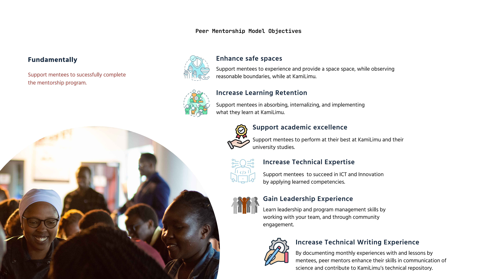

# KamiLimu Peer Mentorship Experience 2024

[Experience 1](experience1/) *11th - 26th April*

`"Our peer mentor coordinated the session wonderfully.  
They took note of the tiniest details and gave us feedback on them.`

`"The mentor is just the right combination of warmth and competence.`

`"I love the relationship we are building with my peer mentor.`

[Experience 2](experience2/) *13th - 27th May*

`"No words would be enough to express how much I enjoy these sessions. My group is the true definition of a safe space. I get to laugh, be vulnerable, receive helpful feedback, and learn so much from others.I loved how creative and informative everyone's presentation was."`

`" I love how encouraging my peer mentees are. They both mentioned that they could see all the growth I'm making and it was very touching."`

`"The session made clear the importance of trusting our instincts, and I’m excited to apply these insights beyond the session, honoring my heart’s guidance in all aspects of life. I can't wait for the next peer mentorship session..."`